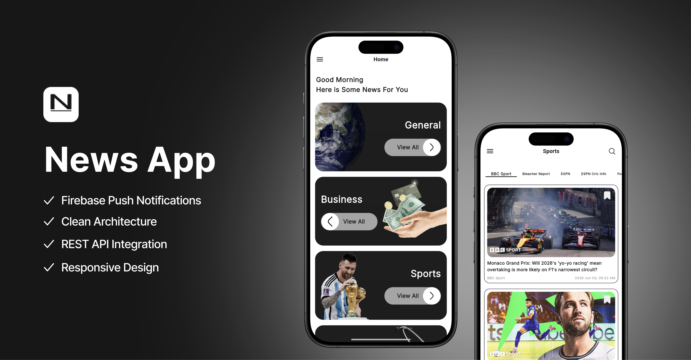
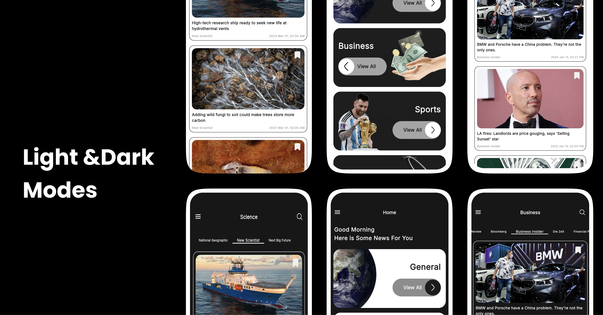
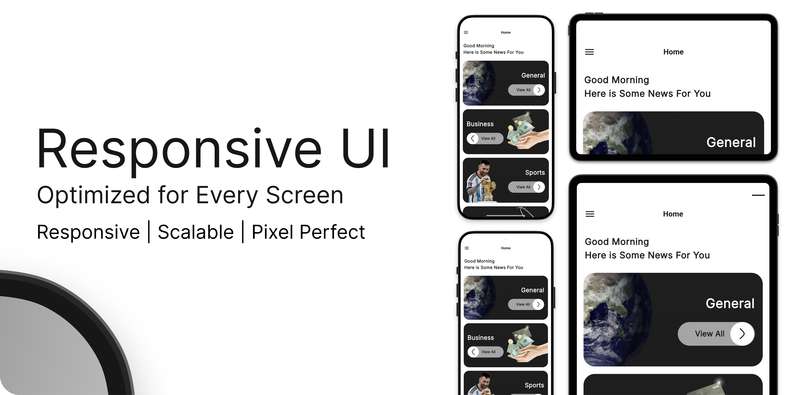
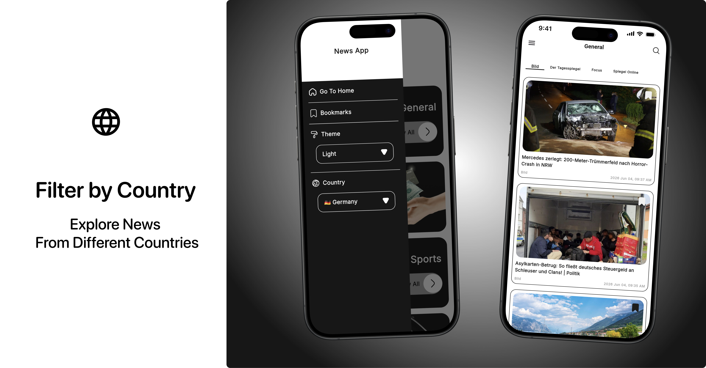
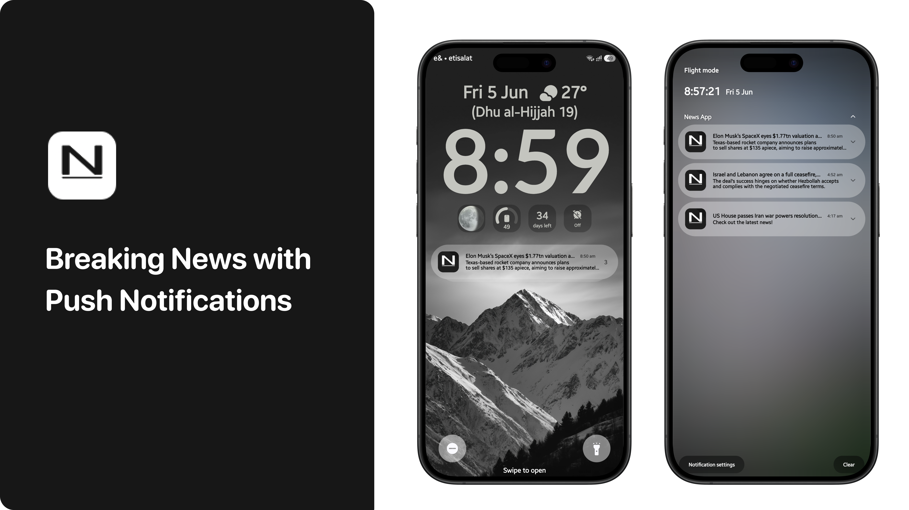
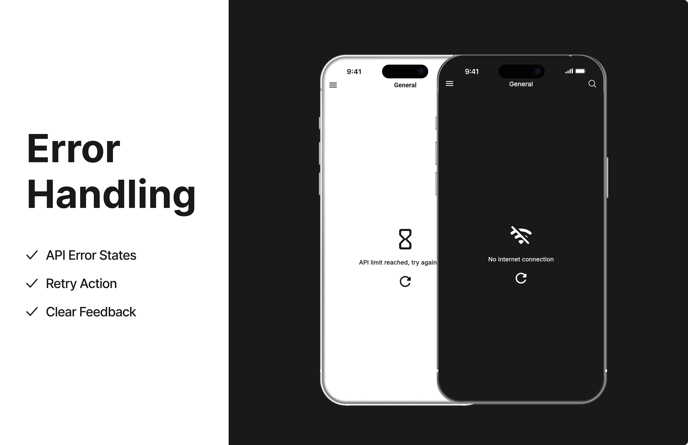

# 📰 News App

A modern Flutter news application that delivers real-time news with push notifications, smart categories, and a clean architecture.

## 🖼️ Screenshots

| Cover | Light & Dark Modes | Responsive UI |
|-------|-------------------|---------------|
|  |  |  |

| Categories | Read Full Article | Filter by Country |
|-----------|-------------------|------------------|
|  |  |  |

| Search | Bookmarks | Push Notifications |
|--------|-----------|-------------------|
|  |  |  |

| Error Handling |
|---------------|
|  |
## ✨ Features

- 🔔 **Push Notifications** — Automated breaking news notifications via Firebase Cloud Messaging, delivered per country using a Node.js backend server deployed on Railway
- 📂 **Smart Categories** — Browse news by category: General, Business, Sports, Science, Health, Entertainment, Technology
- 🌍 **Filter by Country** — Switch between USA, UK, Germany, France, Italy, Russia and more
- 🔖 **Bookmarks** — Save articles locally using Hive for offline reading
- 🔍 **Search** — Real-time search with keyword highlighting
- 🌙 **Light & Dark Mode** — Full theme support with system preference detection
- 📱 **Responsive UI** — Pixel-perfect design optimised for all screen sizes
- 🌐 **Read Full Articles** — Opens the original article directly in the browser
- ⚡ **Shimmer Loading** — Smooth skeleton loading states
- 🔄 **Pull to Refresh** — Refresh news feed with a swipe
- ♾️ **Infinite Scroll** — Pagination for seamless browsing
- ⚠️ **Error Handling** — Unified error UI for network issues, timeouts, and API limits

---

## 🏗️ Architecture

Built with **Clean Architecture** and **BLoC/Cubit** state management.

```
lib/
├── core/
│   ├── network/          # API handler, exceptions
│   ├── services/         # Notifications, Bookmarks
│   ├── routes/           # App navigation
│   ├── theme/            # Light & Dark themes
│   └── widgets/          # Shared components
│
└── features/
    └── news/
        ├── data/         # Models, data sources, repositories impl
        ├── domain/       # Entities, use cases, repository contracts
        └── presentation/ # Screens, cubits, widgets
```

---

## 🛠️ Tech Stack

| Layer | Technology |
|-------|-----------|
| Framework | Flutter |
| State Management | BLoC / Cubit |
| Architecture | Clean Architecture |
| Local Storage | Hive |
| Push Notifications | Firebase Cloud Messaging |
| Backend Server | Node.js + node-cron (Railway) |
| News Data | NewsAPI.org REST API |
| HTTP Client | http package |
| DI | Injectable + GetIt |
| Image Loading | CachedNetworkImage |
| Animations | flutter_bounceable |

---

## 🔔 Push Notification System

The app uses a custom Node.js backend server deployed on Railway that:

- Checks NewsAPI every 30 minutes for new articles
- Sends FCM notifications per country topic (`news_us`, `news_gb`, etc.)
- Users are automatically subscribed to their selected country's topic
- Tapping the notification opens the full article in the browser

---

## 🚀 Getting Started

### Prerequisites

- Flutter SDK `>=3.0.0`
- Firebase project with FCM enabled
- NewsAPI.org API key

### Installation

```bash
# Clone the repository
git clone https://github.com/abdallahnabil07/news.git

# Navigate to project
cd news

# Install dependencies
flutter pub get

# Run code generation
flutter pub run build_runner build --delete-conflicting-outputs

# Run the app
flutter run
```

### Environment Setup

1. Add your `google-services.json` to `android/app/`
2. Add your NewsAPI key to `lib/core/network/network_handler/api_constants.dart`

---

## 📦 Key Packages

```yaml
dependencies:
  flutter_bloc: ^8.x
  firebase_core: ^2.x
  firebase_messaging: ^14.x
  hive_flutter: ^1.x
  cached_network_image: ^3.x
  injectable: ^2.x
  get_it: ^7.x
  http: ^1.x
  url_launcher: ^6.x
  shared_preferences: ^2.x
  flutter_easyloading: ^3.x
  shimmer: ^3.x
```

---

## 👨‍💻 Developer

**Abdullah Nabil**
Flutter Mobile Developer

[](https://www.linkedin.com/in/abdullah-nabil-84263a246)
[](https://github.com/abdallahnabil07)

---

## 📄 License

This project is licensed under the MIT License.